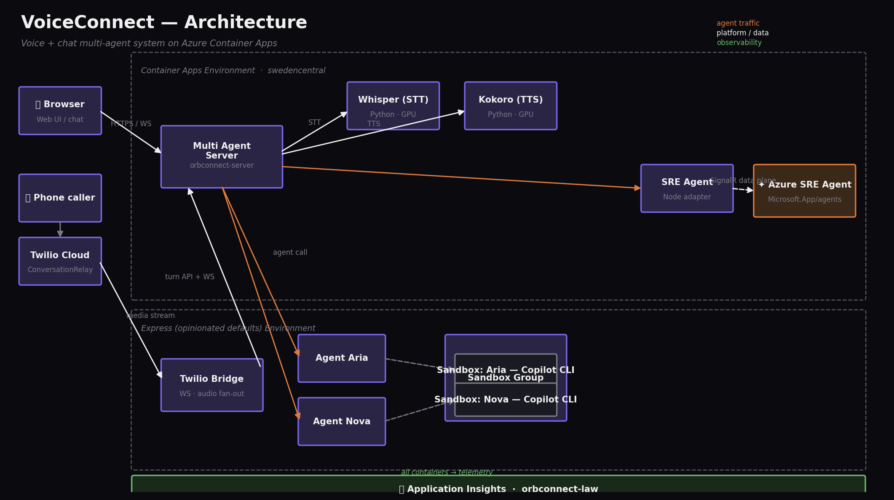

# Architecture

VoiceConnect is a real-time, multi-agent voice and chat assistant deployed
across two Azure Container Apps environments. The same agent pipeline serves
both browser users and inbound phone calls.

## Data plane in one paragraph

A turn starts with audio from a browser microphone or from an inbound phone
call routed through Twilio ConversationRelay. The audio reaches the
multi-agent **server**, which uses Whisper (serverless GPU) to convert it
to text, runs an addressing pass to decide which persona handles the turn,
forwards the request to that persona's agent app, and pipes the agent's
reply through Kokoro (serverless GPU) for text-to-speech, scheduling the
audio chunks back to the client over a WebSocket.

## Components

### Multi-agent server (Sweden Central, standard environment)

A Node.js + TypeScript Azure Container App. Holds the WebSocket hub, the
turn router, and the TTS scheduler. It is the only component that talks
directly to clients.

### Whisper / Kokoro (Sweden Central, serverless GPU profiles)

Two Azure Container Apps backed by serverless GPU workload profiles
(NC8as-T4 for Whisper, A100 for Kokoro). They scale to zero between turns
and are billed only while audio is flowing.

### SRE Agent adapter (Sweden Central, standard environment)

A small Node.js Azure Container App that forwards turns to a managed
**Azure SRE Agent** (`Microsoft.App/agents`) using the Azure agent SignalR
data plane. The adapter lets the multi-agent server treat the SRE Agent
the same way as the in-cluster personas.

### Aria / Nova agent apps (West Central US, Express environment)

Two thin CPU-only Azure Container Apps in an Express environment. Each one
forwards `/chat` requests to its dedicated **Azure Container Apps Sandbox**
where the actual GitHub Copilot CLI process runs. Express was chosen here
for the fast cold-start needed when a turn lands on an idle agent.

### Sandboxes (Sweden Central, session pool)

Each persona has its own sandbox session backed by `Microsoft.App/sessionPools`.
A small HTTP wrapper (`sandbox_wrapper.py`) installed by
`infra/sandbox-bootstrap.sh` serves the agent's HTTP requests on port 8080
under systemd, and runs the GitHub Copilot CLI inside the sandbox so tool
calls never collide with the other persona.

### Twilio bridge (West Central US, Express environment)

A Node.js Azure Container App that terminates Twilio ConversationRelay
calls and translates them into the same WebSocket protocol the browser
client uses. From the server's point of view a phone call is
indistinguishable from a web session.

### Observability

All seven container apps emit telemetry to a single workspace-based
**Application Insights** instance which writes into a shared **Log
Analytics workspace**. Telemetry includes auto-instrumented HTTP requests,
dependencies, traces, and exceptions for every component, plus the ACA
platform-emitted system events.

## Why two environments?

| | Standard env (Sweden Central) | Express env (West Central US) |
|---|---|---|
| Hosts | server, STT, TTS, SRE adapter, sandbox pool | Aria, Nova, Twilio bridge |
| Why | Needs serverless GPU profiles + sandbox session pool, both region-restricted | Needs Express's fast cold-start for per-turn agent invocation; Express not yet available in Sweden Central |

Cross-environment traffic is plain HTTPS over the public ingress; the
multi-agent server holds the source of truth for agent registration and
turn routing.

## Repository layout

The actual code is maintained at
[`simonjj/voiceconnect`](https://github.com/simonjj/voiceconnect). Clone
that repository to run the demo. See
[`deployment.md`](deployment.md) for a guided walkthrough.
